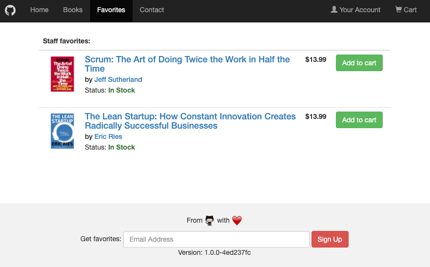

# GitHub Container Demo Bookstore

A Java based Servlet implementation of a bookstore.

## Deployment

This application follows a continuous deployment approach whereby any changes made to the default branch `main` will result in a new build and deployment then being made to the target platform.

This is all managed by using GitHub Actions to build, test, scan and deploy to the configured target platform. The project supports multiple target platforms including:

* Azure Web Apps
* Google Cloud Platform Cloud Run
* Any Kubernetes platform (AKS, GKE, EKS, plain old Kubernetes on prem...)

The target platform is currently controlled using the GitHub Actions workflows and enabling/disabling the desired supporting deployment platforms.

## Getting Started
If you are new and wanting to find out more information on the application and how to get started developing on it, take a look in at the [docs](docs/README.md)

