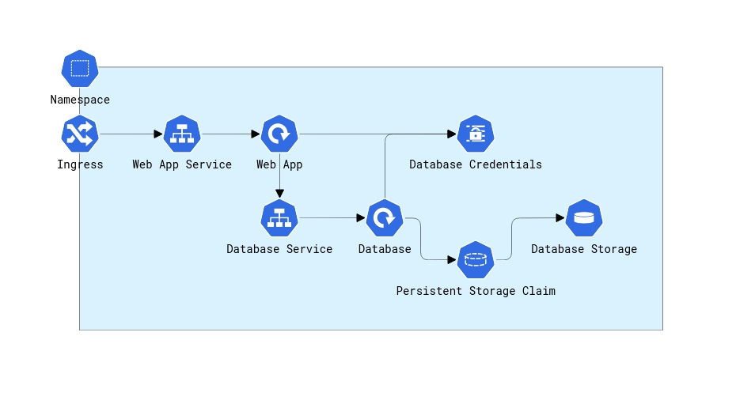

# Kubernetes

The bookstore can be deployed using Kubernetes which can be visualized as follows:

The deployment of the complete bookstore is contstrained to a Kubernetes namespace which then consists of:

* A Secret for storing the user and password credentials for the database.
* A persistence volume and persistence volume claim for holding the contents of the database
* A deployment of a database container image that will use the database Secret to set up a user with the specified credentials and store the contents of the database on the provided volume
* A service to front the database deployment and expose it's port to be bound to (inside the cluster)
* A deployment of a web application container that uses the database Secret to access the database container and serves up the web user interface
* A service to front the web application container(s) and an associated Ingress LoadBalancer to make this available outside the cluster

Terraform modules are provided to make it possible to deploy the Kubernetes objects to any kubernetes cluster that has been authenticated with (making it provider independent). For details on 
